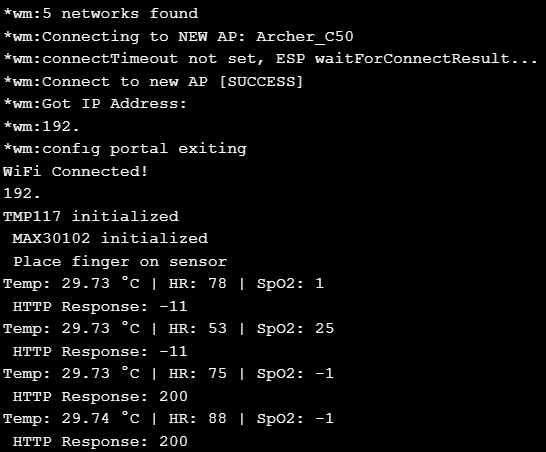
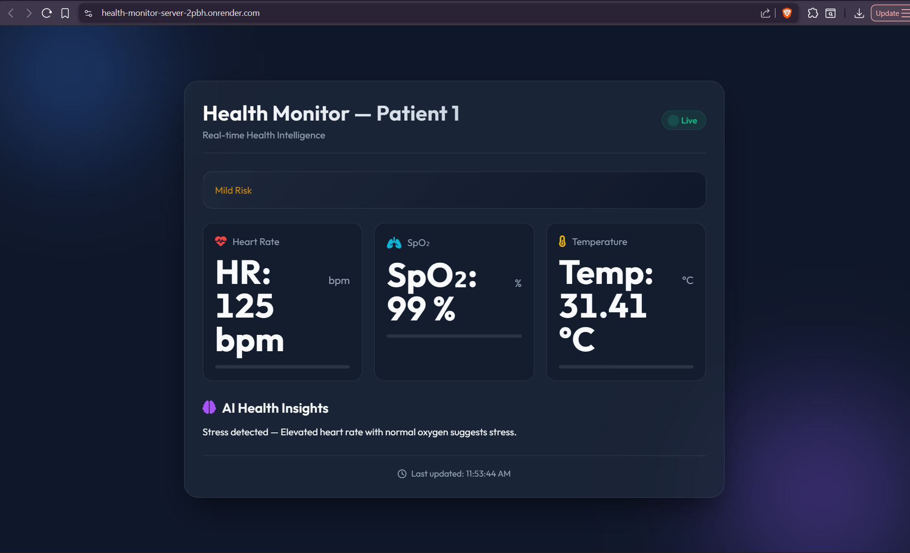

# Health Monitor

> Real-time health telemetry pipeline — ESP32 → Node.js REST API → MongoDB Atlas → Live Web Dashboard

**Live Dashboard:** [your-app.onrender.com](https://health-monitor-server-2pbh.onrender.com)

---

## Screenshots

### Serial Monitor (Live ESP32 Output)


### Web Dashboard


---

## Data Flow
```
ESP32 (C++) ──── HTTP POST /api/data ───► Node.js (Express)
                                               │
                                               ▼
                                        MongoDB Atlas
                                               │
                                               ▼
                                     Web Dashboard (HTML/CSS/JS)
                                     hosted on Render
```

---

## Hardware

| Component        | Model / Spec              | Role                         |
|------------------|---------------------------|------------------------------|
| Microcontroller  | ESP32 DevKit v1           | Data acquisition & HTTP POST |
| Pulse + Sp02     | MAX30102                  | Heart rate (BPM) + Sp02 level|
| Temperature      | TMP117                    | Body/ambient temperature     |
| Power            | USB / 3.7V LiPo           | —                            |

---

## Project Structure
```
healthMonitor/
├── esp32-backend/       # Node.js + Express REST API + MongoDB connection
├── esp32-frontend/      # HTML/CSS/JS dashboard served via Express
├── proj-ph2/            # ESP32 Arduino sketch (.ino) for sensor reading & POST
└── assets/              # Screenshots and diagrams for this README
```

---

## Running Locally

### 1. Backend (Node.js)
```bash
cd esp32-backend
npm install
# Create a .env file:
# MONGO_URI=your_mongodb_atlas_uri
# PORT=3000
npm start
```

### 2. Flash ESP32
- Open `proj-ph2/` in Arduino IDE
- Upload to ESP32

### 3. Dashboard
Navigate to `http://localhost:3000` — data updates in real time as the ESP32 POSTs readings.

---

## Deployment

Backend and frontend are both deployed on **Render** as a single Node.js web service.  
MongoDB is hosted on **MongoDB Atlas** (free tier).

---

## Tech Stack

| Layer       | Technology                     |
|-------------|--------------------------------|
| Firmware    | C++ (Arduino framework, ESP32) |
| Backend     | Node.js, Express               |
| Database    | MongoDB Atlas                  |
| Frontend    | HTML, CSS, Vanilla JS          |
| Hosting     | Render                         |

---

## License

MIT
```

---

## Step 3 — Also add these two small things

**`.gitignore`** at root (if not already there):
```
node_modules/
.env
*.DS_Store
